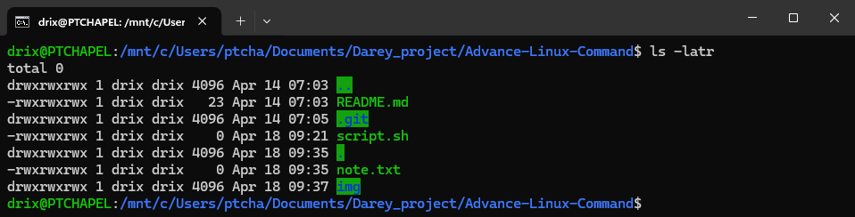

# Advanced Linux: File Permissions, Ownership, and User Management

## File Permissions and Access Rights

Understanding how to manage file permissions and ownership is crucial in Linux. This knowledge empowers you to control access to files and directories, ensuring the security and integrity of your system.

### Numeric Representation of Permissions

Each permission is assigned a numeric value:

- No permission = 0  
- Read = 4  
- Write = 2  
- Execute = 1  

Combined values represent user, group, and others permissions.

Examples:

- `7` = 4 (read) + 2 (write) + 1 (execute) → `rwx`
- `6` = 4 (read) + 2 (write) → `rw-`
- `5` = 4 (read) + 1 (execute) → `r-x`

### Symbolic Representation of Permissions

Linux permissions are often displayed symbolically:

```bash
ls -latr
```

#### Explanation of Output Format:

- First character: `-` for files, `d` for directories.
- Next 3: Owner permissions.
- Next 3: Group permissions.
- Last 3: Others permissions.

Example output:


### Modifying File Permissions

**Create an empty file**:

```bash
touch script.sh
```

**Check current permissions**:

```bash
ls -l script.sh
```


**Add execute permission to all**:

```bash
chmod +x script.sh
```

**Check updated permissions**:

```bash
ls -l script.sh
```


**Using numeric representation**:

```bash
chmod 755 script.sh
```

To make file readable, writable, and executable by all:

```bash
chmod 777 note.txt
```


---

## Changing File Ownership

Changing file ownership is essential for managing access rights. The `chown` command allows you to change the owner and group of a file.

**Syntax**:

```bash
chown [option] owner[:group] file(s)
```

**For example**, to change the owner of `filename.txt` to `john` and group to `developers`, use:
```bash
chown john:developers filename.txt
```

**Check result**:

```bash
ls -latr note.txt
```



---

## Superuser Privileges with `sudo`

Use `sudo` before commands needing elevated rights:

Switch to root:

```bash
sudo -i
```

Exit root:

```bash
exit
```

## User Management on  Linux

### Creating a User

```bash
sudo adduser joe
```


### Granting Administrative Privileges

```bash
sudo usermod -aG sudo joe
```

### Exploring Home Directory

```bash
cd /home/joe
ls -la
```


### Switching Users

```bash
su joe
```

Enter password when prompted.

### Changing Password

```bash
sudo passwd joe
```


Test login with the updated password.


---

## Group Management

### Creating a Group

```bash
sudo groupadd developers
```

### Adding Users to a Group

```bash
sudo usermod -aG developers joe
```

### Verifying Group Membership

```bash
id joe
```


### Deleting a User

```bash
sudo deluser joe
```

---


### Side Hustle Task 3
- Create a group on the server and name it `devops`.
- Create 5 users `["mary", "
mohammed", "ravi", "tunji", "sofia"]` and ensure each user belong to the devops group.
- create a folder for each user in the `/home` directory. For example, `/home/mary`.
- Ensure that group ownership of each created folder belongs to the `devops` group.

## Solution to side hustle task 3:
 The following commands can be used to create the group, users, and folders:
```bash
sudo groupadd devops # Create the devops group
# Create users and add them to the devops group
sudo useradd -m -G devops mary
sudo useradd -m -G devops mohammed
sudo useradd -m -G devops ravi
sudo useradd -m -G devops tunji
sudo useradd -m -G devops sofia
```
see screenshot below for the output of the above command:


The  `-m` flag in the commands above ensures that a home directory (e.g., `/home/mary`) is automatically created for each user.

Use the `chown` command to assign ownership of the folders to the `devops` group:
```bash
sudo chown :devops /home/mary
sudo chown :devops /home/mohammed
sudo chown :devops /home/ravi
sudo chown :devops /home/tunji
sudo chown :devops /home/sofia
```


### Conclusion 

In this lab, we learned how to manage file permissions, ownership, and user management in Linux. We explored the numeric and symbolic representation of permissions, modified file permissions using `chmod`, changed file ownership with `chown`, and managed users and groups effectively. Understanding these concepts is essential for maintaining a secure and organized Linux environment.


